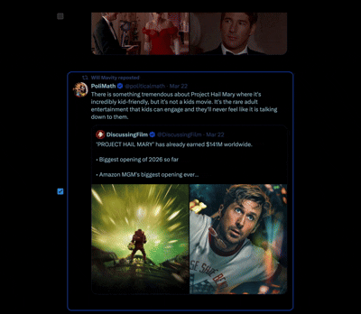
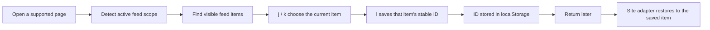

<p align="center">
  
</p>

<h1 align="center">FeedScroller</h1>

<p align="center">
  A local-first browser extension for resuming fast-moving feeds exactly where you left off.
</p>

<p align="center">
  
  
  
  
  <a href="LICENSE"></a>
</p>

> Endless feeds are good at making you lose your place.
> FeedScroller is built to make that problem feel much smaller: move through posts, mark your checkpoint, and come back to the same spot later without manual scrolling.

<p align="center">
  <a href="https://chromewebstore.google.com/detail/feedscroller/ohhbljjllblidifbhhmmommmpkjbndpa">Take me there →</a>
</p>

<p align="center">
  
</p>

## Overview

FeedScroller is a Manifest V3 browser extension that remembers the last post or entry you marked in a supported feed, then restores you to it when you come back.

It is built for the annoying gap between "I was halfway through this feed" and "now the page has shifted, refreshed, paged, or rehydrated and I have no idea where I was anymore." Instead of trying to remember rough scroll offset alone, FeedScroller tracks a stable item identity for each supported site and restores against that item directly.

The extension currently runs without a build step, without a backend, and without a popup UI. You load it unpacked, visit a supported page, and it quietly enhances the page with lightweight keyboard navigation and a save-progress control.

## What It Does

- Moves between visible items with Vim-style keys.
- Lets you mark the current item as your checkpoint.
- Restores back to that saved item when you revisit the feed.
- Scopes progress by feed or tab where that makes sense.
- Uses different restore strategies for different sites, including infinite scroll, "load more," and date-based liveblog navigation.
- Stores progress locally in the browser instead of sending data anywhere.

## Controls

FeedScroller's core interaction model is intentionally small:

| Key | Action |
| --- | --- |
| `j` | Move to the next visible item |
| `k` | Move to the previous visible item |
| `l` | Toggle the saved checkpoint for the current item |

You can also use the checkbox rendered next to supported items to mark progress directly.

Notes:

- If no item is currently selected, the extension anchors on the middle-most visible item first.
- Pressing `l` again on the currently-saved item clears that checkpoint.
- Keyboard handling backs off while you are typing in inputs, textareas, selects, or editable fields.

## Supported Sites

The current repo targets four specific surfaces:

| Site | Supported surface | Scope behavior | Restore style |
| --- | --- | --- | --- |
| X | Home timeline tabs such as `For You` and `Following` | Tab-aware | Scrolls the timeline back toward the saved post |
| Bluesky | Home feed tabs | Tab-aware with a global fallback | Restores through long scrolling feeds |
| Letterboxd | `/activity` | Single fixed scope | Uses the site's "load more" flow until the saved entry is found |
| The Times of Israel | Liveblog pages | Single fixed scope per liveblog surface | Restores within long liveblogs and can recover across dated liveblog pages when needed |

This is a DOM-driven extension, so support is intentionally explicit. If a site redesigns its markup, that adapter may need to be updated.

## How It Works

At a high level, FeedScroller does four things:

1. Detects the current supported feed and the current scope inside it.
2. Finds the list of candidate items on the page and identifies each item with a stable ID.
3. Saves the ID of the item you marked as your last-read checkpoint.
4. On revisit, rehydrates the same scope and walks the feed until that item comes back into view.



The important design choice here is that restore behavior is adapter-driven. The extension does not assume every site is the same:

- X uses an overlay-style renderer and timeline-aware restore logic.
- Bluesky uses feed container detection plus tab-aware scoping.
- Letterboxd restores by stepping through a load-more interface.
- Times of Israel liveblogs include restore helpers for dated liveblog routes and collapsed content blocks.

## Installation

There is no packaging or build step in this repo right now. To use it locally:

1. Download or clone this repository.
2. Open your Chromium-based browser's extensions page.
3. Enable Developer Mode.
4. Choose `Load unpacked`.
5. Select the repository root:
   `Codebase - FeedScroller`
6. Visit one of the supported sites and try `j`, `k`, and `l`.

Chromium-based browsers are the intended target here because the project is currently authored as a Manifest V3 extension. Chrome, Arc, Brave, and Edge are the most natural fits.

## Project Structure

```text
.
|-- content.js
|-- manifest.json
|-- styles.css
|-- js/
|   |-- helpers.js
|   |-- storage.js
|   |-- jkl.js
|   |-- autoscroll.js
|   |-- runtime.js
|   `-- shell.js
|-- sites/
|   |-- bluesky.js
|   |-- letterboxd.js
|   |-- timesofisrael.js
|   `-- x.js
`-- icons/
```

### File Guide

- `manifest.json`: the extension entrypoint and content script wiring.
- `content.js`: route-aware installer that re-dispatches on SPA URL changes.
- `js/shell.js`: the shared adapter engine that turns site specs into working behavior.
- `js/jkl.js`: keyboard navigation, current-item selection, and progress UI rendering.
- `js/autoscroll.js`: restore strategies for scrolling and load-more flows.
- `js/runtime.js`: scope synchronization, restore orchestration, and public runtime API helpers.
- `js/storage.js`: scoped `localStorage` helpers.
- `sites/*.js`: per-site configuration describing selectors, IDs, scopes, tabs, and restore behavior.
- `styles.css`: shared highlight and checkbox styling.

## Local Development

Because there is no build pipeline, the edit loop is very direct:

1. Change the source files in this repo.
2. Go to your browser's extensions page.
3. Click reload on the unpacked extension.
4. Refresh the target site and test again.

That simplicity is one of the project's strengths. Most of the behavior is configuration-driven, so adding or tuning support for a site usually means changing a site spec plus shared detection logic only when necessary.

## Debugging

Each site installs a small public API on `window` for manual debugging in DevTools:

| Site | API |
| --- | --- |
| Bluesky | `window.__arcJK` |
| X | `window.__arcJK_X` |
| Letterboxd | `window.__arcJKLetterboxd` |
| Times of Israel | `window.__arcJKTimesOfIsrael` |

Useful examples:

```js
window.__arcJK?.progress.get()
window.__arcJK?.progress.clear()
window.__arcJK?.resync()
window.__arcJK_X?.getActiveScope()
```

These are helpful when you are tuning selectors, verifying saved progress, or forcing a resync after a DOM change.

## Privacy

FeedScroller is intentionally small and local-first:

- No backend.
- No analytics.
- No remote API calls.
- No cloud sync.
- No extension permissions block beyond the matched content-script surfaces in `manifest.json`.

Saved progress is kept in browser storage on the machine where the extension is running.

## Limitations

- This project depends on live site DOM structure, so markup changes can break individual adapters.
- There is currently no options page, popup, or in-browser settings UI.
- There is currently no automated test suite in the repo; validation is manual.
- Support is focused on the specific routes and surfaces defined in `sites/*.js`, not entire platforms universally.

## Roadmap Ideas

- Add a lightweight popup or options page for per-site enablement and shortcut hints.
- Add exportable test fixtures or selector smoke tests for site adapters.
- Add a small visual debug mode to inspect detected items and current scope.
- Expand support to additional feeds using the shared site-shell architecture.

## Assets For This README

The README now expects these two media files:

| Asset | Path | Notes |
| --- | --- | --- |
| Logo | `docs/images/logo.jpg` | The top logo image shown above the title. |
| Demo GIF | `docs/images/feedscroller-demo.gif` | The centered product demo shown under the badges. Displayed at `width="500"` so it stays compact. |

Recommended GIF capture:

- One supported feed page with the highlighted current item visible.
- The progress checkbox visible beside the item.
- Enough surrounding feed context to make the motion obvious without making the file huge.

## License

FeedScroller is [MIT licensed](LICENSE).
